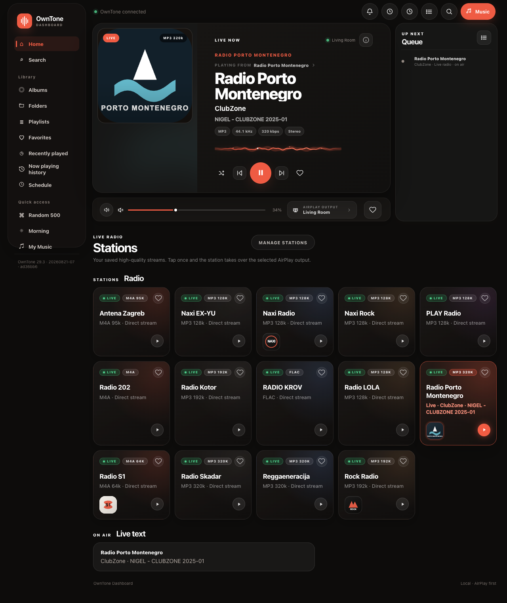
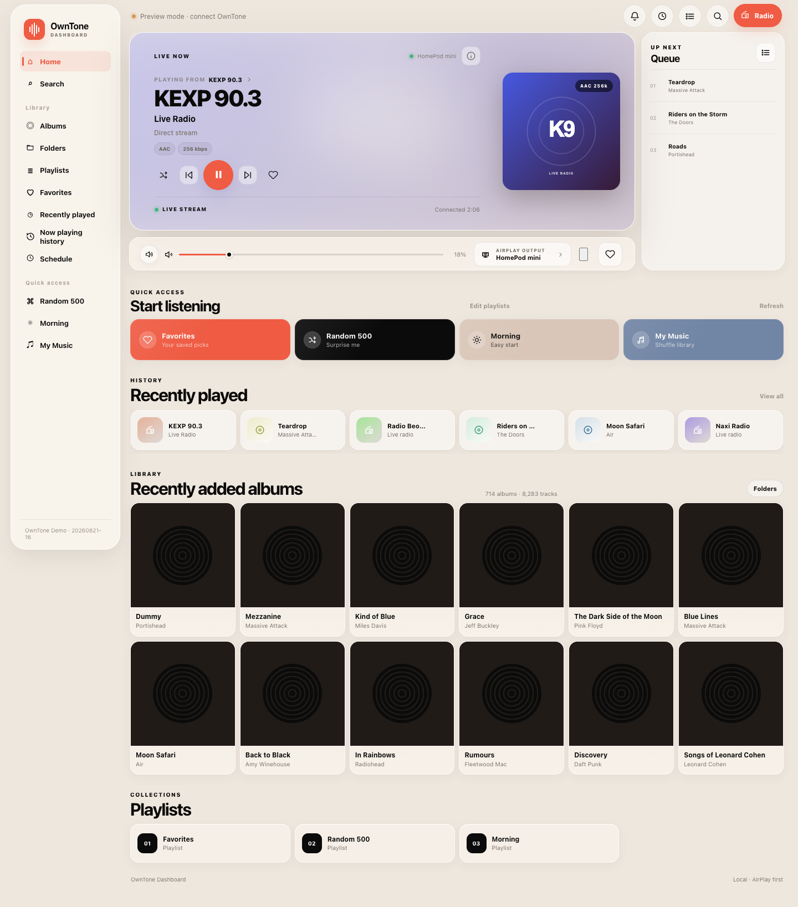
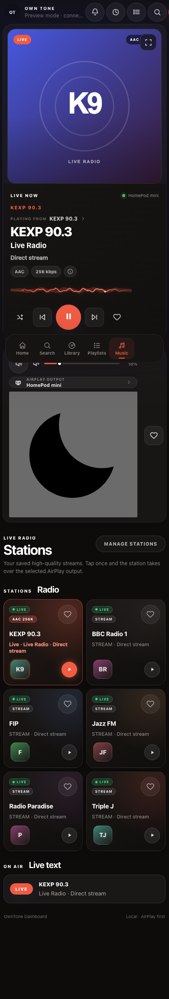

# OwnTone Dashboard

A polished, AirPlay-first web dashboard for [OwnTone](https://github.com/owntone/owntone-server)
(forked-daapd) — built for HomePods, multi-room listening and beautiful live radio.

OwnTone ships a minimal built-in web UI. This dashboard replaces it with a
premium experience: live radio cards with health probes, a persistent listening
history, schedules with sunrise ramps, night-safe volume, multi-room AirPlay
control, queue management, folder browsing and a zero-dependency Python
companion service.

**No build step. No Node on your server. No database.** Static files + nginx +
one small Python service.

## Features

- 📻 **Live radio cards** — server-side stream health probes (LIVE / OFFLINE),
  per-station quality labels, favorites, drag & drop, live "now playing" text
- 🎛 **Full player** — artwork with mood accent, track chips (codec / rate / size),
  seek, queue drawer with drag-reorder and swipe-delete
- 🌙 **Night-safe volume** — manual playback capped (default max 8 %) between
  configurable hours, including a per-schedule opt-in cap
- ⏰ **Scheduler** — weekly rules, radio or playlists, AirPlay output, volume,
  sunrise ramp (raise volume over N minutes), optional stop time, fallback
  station if the stream is dead, "Play now"
- 😴 **Sleep timer** — server-side fade-out over the last 3 minutes, works with
  the dashboard closed
- 🔊 **Multi-room AirPlay** — select and tune every speaker independently,
  group volume, room presets ("scenes"), optional browser output alongside
  AirPlay
- 🗂 **Library browsing** — recently added albums, genre & artist chips,
  folder browser with per-track "play next" / "add to queue"
- 📝 **Playlist editor** — create and edit plain `.m3u` playlists from the UI
- 📊 **Insights** — 30-day play chart, top stations & artists, live activity feed
- 🖥 **Screensaver** — fullscreen blurred artwork + clock after 60 s idle
- 🔔 **Desktop notifications** for scheduled runs and timer events
- ⌨️ **Keyboard shortcuts** — space, arrows, M/N/P/R, `?` for the legend
- 🏠 **HomeKit bridge recipe** — expose every station to Siri (see below)
- 🧩 **Companion service** — pure Python stdlib: schedules, history, stats,
  radio health, playlist & station file management

| Radio mode (dark)                    | Music mode (light)                    | Mobile                                 |
| ------------------------------------ | ------------------------------------- | -------------------------------------- |
|  |  |  |

## Quick start

Requirements: a host running OwnTone, nginx and Python 3.

```sh
git clone https://github.com/vladimirperovic/owntunedashboard.git /opt/owntone-dashboard

# 1. nginx site (serves the dashboard on :3690, proxies /api and /scheduler)
sudo cp deploy/nginx.conf /etc/nginx/sites-available/owntone-dashboard
sudo ln -sf ../sites-available/owntone-dashboard /etc/nginx/sites-enabled/
sudo nginx -t && sudo systemctl reload nginx

# 2. companion service (schedules, history, stats, radio health)
sudo install -m0644 deploy/owntone-dashboard-scheduler.service /etc/systemd/system/
sudo systemctl daemon-reload
sudo systemctl enable --now owntone-dashboard-scheduler.service
```

Open `http://<your-host>:3690`. If OwnTone is not reachable the dashboard runs
in **Preview mode** with demo data — the same mode powering the
[live demo](https://vladimirperovic.github.io/owntunedashboard/).

Full deployment walkthrough (including a Proxmox LXC flow): see
[`DEPLOY_AGENT.md`](DEPLOY_AGENT.md). Personal hosts stay out of git via
`deploy/deploy.local.conf` (see `deploy/deploy.local.conf.example`).

## Configuration

Everything lives in [`config.js`](config.js) — API paths, poll intervals,
night-safe hours and cap, preferred output, default folder, per-station quality
labels and artwork. The defaults work out of the box; tune stations and paths
to your library.

## Radio stations

Drop one `.m3u` file per station into a folder whose path contains `/Radio/`
(configurable) and refresh the OwnTone library — or use the built-in
**Manage stations** dialog, which writes the files and rescans for you.

## HomeKit / Siri

Pair the dashboard's stations with Apple Home using any HomeKit HTTP-switch
bridge (e.g. [homebridge](https://homebridge.io) +
[homebridge-http-switch](https://www.npmjs.com/package/homebridge-http-switch)):

- ON → `POST http://<host>:3690/scheduler/stations/<slug>/play`
- OFF → `POST http://<host>:3690/scheduler/playback/stop`
- state → `GET  http://<host>:3690/scheduler/stations/<slug>/status`
- list stations → `GET http://<host>:3690/scheduler/stations`

Name a switch per station (plus a short alias you would actually say) and ask
Siri to turn it on. Switch state is read from OwnTone's live player, so it stays
correct after a service restart and after a scheduled run. A `POST /scheduler/stations/random/play` endpoint
is included for a "Shuffle Radio" switch.

## macOS menu bar

`tools/menubar/owntone.10s.sh` is a ready-made
[SwiftBar](https://swiftbar.swiftbar.app) plugin: current track in the menu
bar with play/pause, next/previous and volume presets.

## Radio station detection

A playlist counts as a station when its file path contains `radioPathHint`
(`/Radio/` by default). `radioNameHints` in [`config.js`](config.js) adds
whole-word name fallbacks for libraries where stations are not all in one
folder — keep that list short, since anything in it can misread an album
playlist as a station. The companion service reads the same two settings from
`OWNTONE_RADIO_PATH_HINT` and `OWNTONE_RADIO_NAME_HINTS`; keep them in step.

## Development

```sh
npm install
npx playwright install chromium
```

| Command                                                    | What it checks                           |
| ---------------------------------------------------------- | ---------------------------------------- |
| `npm run lint`                                             | ESLint over every script                 |
| `npm run format` / `npm run format:check`                  | Prettier                                 |
| `npx playwright test`                                      | Desktop and mobile UI, against demo mode |
| `python3 -m unittest discover -s scheduler -p 'test_*.py'` | Companion service logic                  |
| `ruff check scheduler/`                                    | Python lint                              |

CI runs all of them on every push and pull request.

### How the front end is put together

No build step — plain `<script>` files loaded in order by
[`config.js`](config.js), which is also where the `?v=BUILD` cache buster
lives.

- [`shared.js`](shared.js) is the common layer: config, the request helpers for
  both back ends, `escapeHtml`, the toast, the event bus, the icon set, the
  night-safe rule, and `startPlayback()` — the single entry point every
  playback path goes through.
- [`app.js`](app.js) owns the player, the library and the radio grid, and
  announces `owntone:ready` and `owntone:library-updated`. Feature modules wait
  for those events rather than polling.
- Feature modules mount themselves into the shell and talk to `app.js` through
  `window.OWNTONE_APP`.

CSS uses cascade layers, declared at the top of
[`styles.css`](styles.css):

```css
@layer base, components, system, features, polish;
```

A later layer wins over an earlier one regardless of selector specificity, so
overriding a base rule does not need `!important` — there are none in the
stylesheets.

## Disclaimer

This is an independent community project and is **not** affiliated with or
endorsed by the OwnTone project. "OwnTone" is used solely to describe
compatibility.

## License

[MIT](LICENSE)
